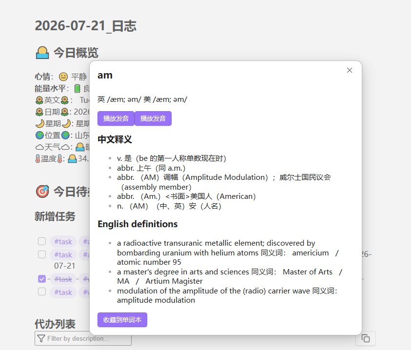

# AI Translate

> 在 Obsidian 中查英文单词、翻译选中文本，并可将词条保存到自己的单词本。

[English](README.md) · [功能说明](#功能预览) · [安装](#安装) · [快速开始](#快速开始)



AI Translate 是贴合 Obsidian 阅读与写作流程的查词翻译插件。选中内容即可查询，无需离开当前笔记；内置服务优先提供词典和翻译，必要时可切换到自己的 OpenAI-compatible API。

## 功能预览

| 场景 | AI Translate 的处理方式 |
| --- | --- |
| 阅读英文资料 | 选中单个英文单词，查看音标、中英文释义与可用的英式、美式发音。 |
| 理解句子或段落 | 选中内容后翻译；中文自动译为英文，其他语言译为设置的目标语言。 |
| 主动查询 | 从 Command Palette 打开输入框，输入单词或文本。 |
| 复习生词 | 将英文查词结果自动或手动提交到兼容的外部单词本 API。 |

## 要求

- Obsidian `1.12.2` 或更高版本。
- 仅当内置有道服务不可用或被关闭时，才需要可用的 OpenAI-compatible API。

## 安装

### 社区插件

插件通过 Obsidian Community plugins 审核后，打开 **Settings > Community plugins**，搜索 **AI Translate** 并安装。

### GitHub Release

1. 下载与插件版本完全一致的 GitHub Release 中的 `main.js`、`manifest.json` 和 `styles.css`。Obsidian 使用不带 `v` 前缀的 Release tag。
2. 在仓库（vault）中创建 `.obsidian/plugins/ai-translate/` 目录。
3. 将这三个文件复制到该目录。
4. 在 **Settings > Community plugins** 中启用 **AI Translate**。

## 快速开始

1. 在笔记中选中一个英文单词、句子或段落。
2. 右键选择 **AI Translate: 查询选中文本**，或在 Command Palette 运行 **AI Translate: Look up selected text**。
3. 单词会显示词典结果；其他文本会显示翻译结果。
4. 需要手动输入时，在 Command Palette 运行 **AI Translate: Lookup or translate**。

默认启用内置有道服务，通常无需额外配置。只有当内置服务不可用、需要指定翻译模型，或需要接入单词本时，才进入设置页配置。

## 翻译设置

| 设置项 | 说明 |
| --- | --- |
| 内置有道服务 | 优先使用有道移动词典和翻译服务；不可用时使用 OpenAI-compatible API。 |
| API Base URL | OpenAI-compatible API 的基础地址，例如 `http://localhost:1234/v1`。 |
| Endpoint Path | API 路径，通常为 `/chat/completions`。 |
| Model | 备用 API 请求所使用的模型名称。 |
| 目标语言 | 非中文输入的翻译目标，例如 `简体中文`。 |

备用 API 使用 `POST` 请求，并发送 OpenAI Chat Completions 兼容的请求体。请确保基础地址、路径和模型名称与服务端配置一致。

## 外部单词本

外部单词本默认关闭。启用后，成功查询英文单词可以自动保存，也可以在查询结果中手动保存。保存请求独立于查询和翻译流程执行；请求失败不会影响查词、发音或翻译结果。

| 设置项 | 说明 |
| --- | --- |
| 启用单词本适配 | 允许将英文单词查询结果提交给外部服务。 |
| 查询后自动收藏 | 成功查询后自动保存；关闭后在结果窗口显示收藏按钮。 |
| 单词本 API 地址 | 外部单词本的完整请求 URL。默认值为 `http://127.0.0.1:3000/api/v1/words`。 |
| 请求方法 | `POST` 发送 JSON 请求体；`GET` 将模板的一层字段发送为查询参数。 |
| 请求参数（JSON） | 定义发送给单词本服务的字段及占位符。 |
| 认证方式 | 可选 `Bearer Token`、`Basic` 或无认证。 |
| 认证凭据 | 所选认证方式使用的凭据。该字段以密码形式显示。 |
| 自定义请求头（JSON） | 额外的 HTTP 请求头，例如服务要求的自定义认证头。 |

所有受支持的 Obsidian 版本共用一套设置实现。启用外部单词本后，设置页会刷新并显示相关字段。认证凭据使用密码输入框并保持掩码显示；翻译设置中没有单独的 API Key 字段。

### 请求模板与字段映射

默认 `POST` JSON 请求体如下：

```json
{
  "headword": "{{headword}}",
  "phoneticUs": "{{phoneticUs}}",
  "phoneticUk": "{{phoneticUk}}",
  "definitionZh": "{{definitionZh}}",
  "definitionEn": "{{definitionEn}}"
}
```

可用占位符：

| 占位符 | 内容 |
| --- | --- |
| `{{headword}}` | 原始英文查询词。 |
| `{{phoneticUs}}` | 美式音标。 |
| `{{phoneticUk}}` | 英式音标。 |
| `{{definitionZh}}` | 中文释义。 |
| `{{definitionEn}}` | 英文释义。 |

为兼容旧配置，插件同样支持 `{{word}}`、`{{definition}}`、`{{phoneticUS}}` 和 `{{phoneticUK}}`。

例如，下列模板可将字段映射到另一套单词本 API：

```json
{
  "word": "{{headword}}",
  "usIpa": "{{phoneticUs}}",
  "ukIpa": "{{phoneticUk}}",
  "translation": "{{definitionZh}}",
  "definition": "{{definitionEn}}"
}
```

插件支持 `POST`、`GET`、自定义 JSON 请求头以及 Bearer、Basic 或无认证。除非自定义请求头已经提供同名字段，每次实际保存请求都会添加 `Idempotency-Key`。同一个单词尚未完成的并发保存会合并为一次请求。

## 隐私

AI Translate 不会向运营方控制的服务收集或传输数据。词典与翻译请求只会发送至有道，或发送至你自行配置的 OpenAI-compatible API。外部单词本请求只会在你启用并配置该功能后发出。

## 从源码构建

完整仓库构建浏览器发布包和仅构建 Obsidian 插件均只需要 Node.js。

```sh
cd obsidian-plugin
npm ci
npm run check
```

`npm run check` 会构建 `main.js`、进行 TypeScript 校验并执行插件测试。

插件使用 Obsidian `1.12.2` API 类型包编译，并在 manifest 中声明最低应用版本为 Obsidian `1.12.2`。设置页使用传统 `PluginSettingTab.display()` API，从而让 `1.12.2` 与更新版本共用同一套字段定义，避免两套设置长期漂移。

在仓库根目录单独构建 Obsidian 发布包：

```sh
npm run release:obsidian
```

构建产物将写入 `dist/release/obsidian/<version>/`。

Release tag 必须与 `manifest.json` 中的版本完全一致，且不能带 `v` 前缀。

## 项目支持

AI Translate 是开源项目。它对你的笔记工作流有帮助时，可以通过以下方式支持项目：

- 在 [GitHub 仓库](https://github.com/DXShelley/ai-translate) 点亮 Star，帮助更多 Obsidian 用户发现它。
- 在 [Issues](https://github.com/DXShelley/ai-translate/issues) 提交可复现的问题、功能建议或兼容性反馈。
- 通过 Pull Request 改进代码、文档或翻译；提交前请运行相关检查。
